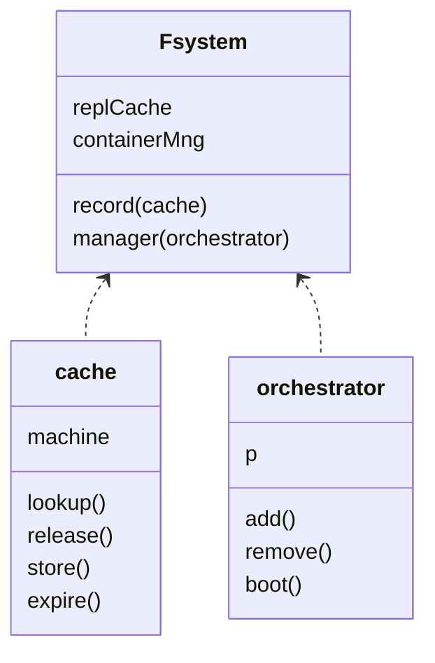
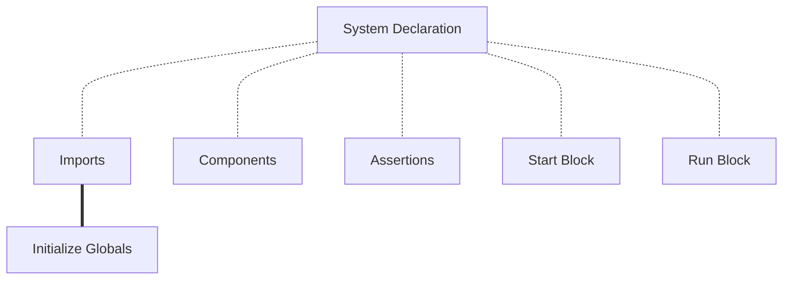
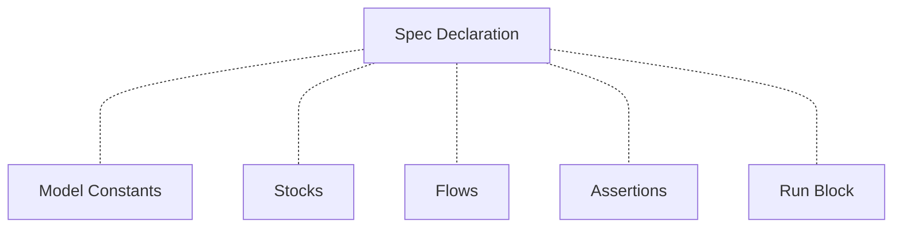

# Fsystem and Fspec Files
Fault has two different types of files the compiler knows how to read `.fsystem` files which define the model's state chart and `.fspec` files which define model specifications. You can define models to use either a single `.fsystem` or a single `.fspec` file, or use an `.fsystem` file to import multiple `.fspec` files for more complex systems.

## Single Level Imports
Only `.fsystem` files can import other files. Fault only allows a single level of imports. A model state chart can import specifications. State charts cannot import other state charts. Specifications cannot import state charts or other specifications. This allows models to be broken up into reusable parts, but doesn't allow circular imports or long dependency chains. In general I'm cynical about the benefits of complex inheritance patterns and over generalized abstractions from OOP. I think such things make code look pretty at the expense of understanding the behavior of that code, which is of greater importance.

## Layout of a Fsystem File
`.fsystem` files have a set of required elements and the set of optional elements.

|:-------------|:------------------|
| **Required** | System Declaration, Components, Start Block |
| **Optional** | Imports, Assertions, Run Block   |

A `.fsystem` file is the state chart of the entire system being modelled. It's the high level view of system behavior. Assertions particular to stock/flow behavior should be in the `.fspec` file where those behaviors are defined if possible so that everything in the `.fsystem` focuses on the state chart.

The compiler expects a system declaration statement first, followed by any imports, followed by initializing stocks and flows from those imports, followed by the components, then assertions and ending the file with a start block and/or a run block. The run block (if present) always comes last.

## Fspec Files
`.fspec` files have a similar structure to the `.fsystem` file but a different set of structures can be declared.

|:-------------|:------------------|
| **Required** | Spec Declaration, Stocks/Flows |
| **Optional** | Constants, Assertions, Run Block   |

A `.fspec` file defines one complete interaction that determines the transition of the state machine from one state to another. Stocks/Flows can be defined in a `.fspec` file but not components. Likewise components can be defined in `.fsystem` but Stock/Flows must be imported.

Single file models in Fault--therefore--are either all state machine, or a specification of a single process.

