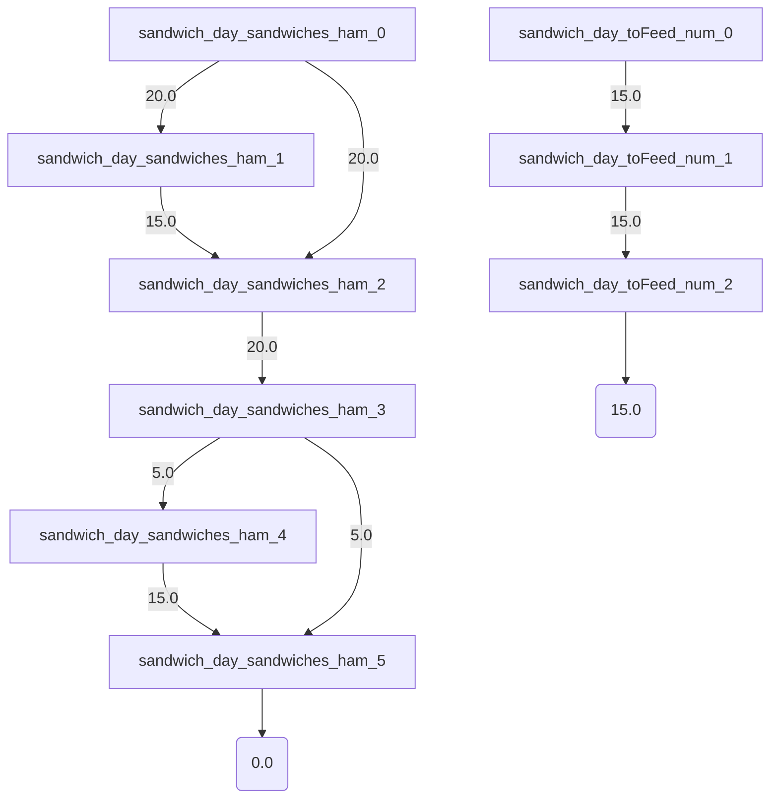

# Fault
Fault is a domain specific language for building models of complex systems based on the principles of system dynamics as developed by Jay W. Forrester.

{: .warning }
Fault is still in **pre-alpha** which means full of bugs. If you're up for adventure you should write a model and open an [issue about it](https://github.com/Fault-lang/Fault/issues) so that I can continue to improve the stability of the compiler.

## Let's Model A Thing!
Let's suppose that we work at a startup with a free lunch policy. We have a certain number of employees and need a certain number of sandwiches each day. We don't want to run out of sandwiches and we don't want to have too many leftover sandwiches.

We don't need a complex model to solve this problem-- we can just get one sandwich per employee and call it a day. But this solution leaves a lot of potential edge cases that will cause our solution to fail. For example, what if some of our employees decide to take two sandwiches? What if a few decide to skip the free option and go out for lunch? What happens to the leftover sandwiches at the end of the day? Do we throw them out or do we let people eat them the for the following lunch, thereby gradually increasing our surplus?

Formal models (or specifications) of systems help us diagnose and explore these edge cases. If you wanted an absolute guarantee that your lunch service will never run out of sandwiches and will never have too many extras, you need to create a model that specifies how your process for doing lunch keeps those edge cases from happening.

Okay here's our model in Fault:

```
spec sandwich;

def supplies = stock{
    ham: 20,
};

def people = stock{
    num: 15,
};

def lunch = flow{
    sandwiches: new supplies,
    toFeed: new people,
    service: func{
        sandwiches.ham -> toFeed.num; 
    },
    prep: func{
        if sandwiches.ham < toFeed.num {
            sandwiches.ham <- (toFeed.num - sandwiches.ham);
        }
    },
};

assert supplies.ham >= 0;

for 2 run {
    day = new lunch;
    day.prep;
    day.service;
}
```

Let's break this down bit by bit.

The basic parts of a Fault spec are **stocks** and **flows**. Stocks are collections of resources, in this case sandwiches and people. 

```
def supplies = stock{
    ham: 20,
};

def people = stock{
    num: 15,
};
```

Flows are functions that cause the amount of stocks to change. In our model we have two different ways our stock of sandwiches changes. First we prepare sandwiches for lunch, increasing their amount. Then we serve those sandwiches and people eat them :)

To do this we attach an instance of the previous defined stocks to our flow with `new supplies` and `new people`.

```
def lunch = flow{
    sandwiches: new supplies,
    toFeed: new people,
    service: func{
        sandwiches.ham -> toFeed.num; 
    },
    prep: func{
        if sandwiches.ham < toFeed.num {
            sandwiches.ham <- (toFeed.num - sandwiches.ham);
        }
    },
};
```

The `service` function is straight forward, we deduct enough sandwiches from out stock of sandwiches to feed the number of people we have.

The `prep` function has a bit more logic to it. If we have leftover sandwiches we don't want to waste them. So we will only make more sandwiches if we don't have enough for everyone and we will only make the number of sandwiches we need to feed everybody.

Like most model checkers, Fault uses **bounded loops** which means that Fault will only "run" the model for a certain number of steps. It will not check an infinite amount of time.

To tell Fault how many iterations of the loop to check and what happens during one loop we define a **run block**

```
for 2 run {
    day = new lunch;
    day.prep;
    day.service;
}
```

Here we initialize a flow with stocks attached, then we tell Fault to first run the prep function, then the service function. We tell Fault this model had a runtime of 2 loops. 

We can run the model at this point and it will produce a basic simulation.



Here you can see that when we say Fault runs the model, it isn't actually evaluating any code. Instead it is exploring all possible branches of the behavior and converting them into logic rules (more on this later). We start off with 20 sandwiches and Fault says in the first step of the model we have two scenarios: either we have 20 sandwiches or we have 15 sandwiches.

You're probably wondering why we would have 15 sandwiches at any point in the first loop. It's because the first thing we do in the loop is prepare sandwiches for lunch that day and the way we've defined that process is as follows:

_If the number of sandwiches is less than the number of people, add difference between sandwiches and people_

But Fault will explore both the scenario where the conditional is true and the scenario where it is false. It doesn't evaluate the conditional, it neither knows nor cares if the conditional is true. It just creates a rule in SMT that says if the conditional IS true than the number of sandwiches should be increased by the number of people less the sandwiches we have. Since in the first loop we have MORE sandwiches than people that number is -5. 20 - 5 = 15 sandwiches. The solver then dismisses that value and selects the correct value of 20 for future steps.

So the way this plays out is that state 0 of the variable sandwich_day_sandwiches_ham is 20, state 1 (the conditional is true) is 15, state 2 (the conditional is false) is 20 and state 3 is a _phi value_ where the solver selects either the true branch or the false branch. Written this way the model checker briefly peeks into other potential futures.

There are ways of fine tuning our specification to eliminate this behavior that we'll get to later. What's useful about looking at all possible scenarios in the model is that it allows us to consider what the system behavior would be if safety checks happened too late, if we've created race conditions, if we don't get a response from a request ... all things that happen on real systems and sometimes cause problems.

There's one more part of our model we're going to add. We're going to tell Fault we believe it is impossible that we'll run out of sandwiches and ask it to prove us wrong.

```
assert supplies.ham >= 0;
```

Asserts allow us to focus the solvers attention on how our model affects specific properties (invariants). Our simple sandwich model doesn't have many potential states because the number of sandwiches and the number of people are both set upfront. As models grow more complex there will be scenarios where many potential values could be assigned to a variable and the solver needs to choose one and move on. In these cases running the solver again might produce a slightly different scenario. [Alloy](https://cacm.acm.org/magazines/2019/9/238969-alloy/fulltext) is a good example. Every run of the solver will produce a different result.


Because we've done a good job with our first model, Fault is happy to tell us it can find no specific failure case where our assert is untrue.

## Fault Philosophically
Most languages for formal system specification are designed to prove system properties correct. But since the learning curve for writing models in these languages is so steep, when the beginner receives a positive result (no failure cases) it is almost certainly because they haven't written the model correctly. This creates a weird and frustrating experience where new users can't trust their success and can't appreciate their progresss.

Fault can be used in this way if you want, but that's not what I built it for. Fault is based on the assumption that ALL systems fail eventually. The purpose of a specification written in Fault is to explore the conditions under which the system might fail.