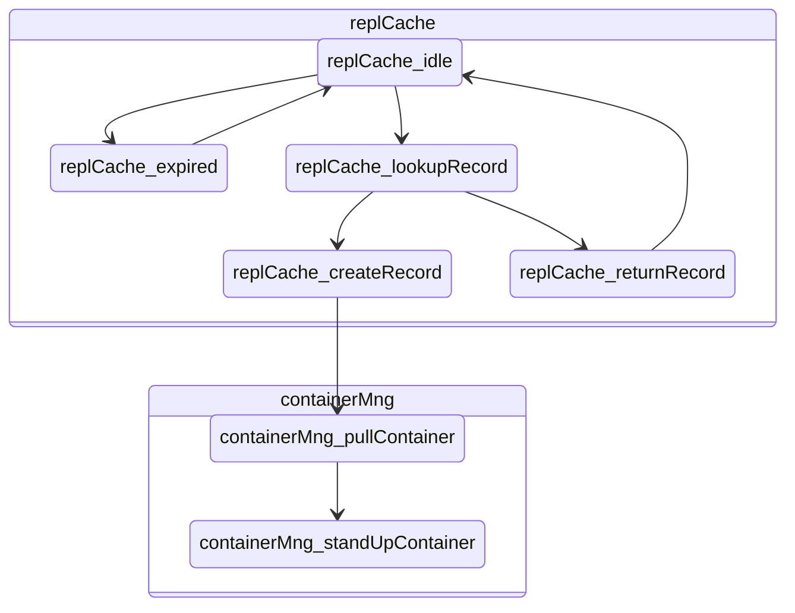

# Components
We could breakup [this architecture](https://cloud.google.com/customers/repl-it/) into a bunch of different components but we decide to start with two: a cache and a container manager.

## Container Manager
Let's focus on the container manager first. What are the potential states the container manager could be in?

Well first of all it could be idle, waiting for a request to come in.

But once a request comes in the first thing we expect it to do is pull the proper container from the container registry. Then it stands the container up. Then at some later point when the user is done with the repl, it shuts down the container.

So in Fault we define a component and give it those states

```
component containerMng = states{
    idle: sfunc{
       ...
    },
    pullContainer: sfunc{
        ...
    },
    standUpContainer: sfunc{
        ...
    },
    shutdownContainer: sfunc{
        ...
    },
};
```

The transitions between states are nice and orderly. We don't have any real forks in the road to contend with.


```mermaid
stateDiagram
	containerMng_idle --> containerMng_pullContainer
	containerMng_pullContainer --> containerMng_standUpContainer
	containerMng_standUpContainer --> containerMng_shutdownContainer
	containerMng_shutdownContainer -->
containerMng_idle
```

## Cache
The cache sits in front of the container manager and routes requests to active containers it knows about or back to the container manager to create a new environment for the repl.

The cache too can be idle when no requests are coming in. When a request enters the system, the cache first checks to see if it knows an active container the request belongs to. If it does it returns the record and reroutes the request to the correct place. If it doesn't it passes the request back to the container manager and (eventually) creates a new record. Periodically it goes through all its records and cleans up the old ones.

```
component replCache = states{
    idle: sfunc{
       ...
    },
    lookupRecord: sfunc{
        ...
    },
    returnRecord: sfunc{
        ...
    },
    createRecord:sfunc{
        ...
    },
    expired: sfunc{
        ...
    },
};
```

## State Machine
While most single components can be drawn as state machines that loop back on themselves, our REPL's two components actually interact with each other. When the cache can't find a record of an active container it triggers a state change on the container manager. The container manager's response triggers a state change on the cache (storing the record).

If we want to visualize that exchange it might look something like this:



## Run Block
To tell Fault which states the model starts from, use a `run` block. The `run` block specifies initial state for each component and the sequence of steps to verify:

```
run {
    replCache.lookupRecord | containerMng.idle;
}
```

## Run Block vs. Default Execution
If a `.fsystem` file does not have a run block, Fault will execute each component in the order they are defined. If you want Fault to go farther you can define a run block with the number of steps you need:

```
run {
    Arrival | Processor;
    Arrival | Processor;
    Arrival | Processor;
    Arrival | Processor;
    Arrival | Processor;
}
```

When you import `.fspec` files Fault ignores whatever run blocks they might have (but honors any defined invariants like assertions or assumptions). This allows you to treat specifications as subsystems that can run as stand alone models as well as pieces of a larger more complex system.
